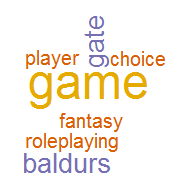

## Working with Unstructured Text

- Working with unstructured text can be tricky
- Text analytics can help to extract valuable information from messy text
- For example, given a chunk of text:

> Baldur's Gate is a fantasy role-playing video game developed by BioWare and published in 1998 by Interplay Entertainment. It is the first game in the Baldur's Gate series, and takes place in the Forgotten Realms, a high fantasy campaign setting, using a modified version of the Advanced Dungeons & Dragons (AD&D) 2nd edition rules. The game received critical acclaim and was credited for revitalizing the computer role-playing game genre. The game allows development of the player character through choice of companions, dialogue choice, exploration, and battle. Baldur's Gate uses a reputation system, and rewards the player depending on the choices made in the game.

- The first step is to tokenize the text

--- .class #id

## Tokenization

- The process of breaking a stream of text into tokens
- Tokens can be individual words, phrases or symbols
- Punctuation, numbers and whitespace are stripped and stopwords i.e. common words are removed
- This can be done quite simply in R using the 'tm' package
- Working with the string ("input") from earlier:


```r
library(tm)
docs <- Corpus(VectorSource(input))
docs <- tm_map(docs, removePunctuation)
docs <- tm_map(docs,content_transformer(tolower))
docs <- tm_map(docs, removeWords, stopwords("english"))
docs <- tm_map(docs, stripWhitespace)
```

--- .class #id

## Document-Term Matrix

- The tokens can then be organized in a Document-Term Matrix
- Each row is a document and each column is a unique term


```r
dtm <-DocumentTermMatrix(docs)
dtm
```

```
## <<DocumentTermMatrix (documents: 1, terms: 54)>>
## Non-/sparse entries: 54/0
## Sparsity           : 0%
## Maximal term length: 13
## Weighting          : term frequency (tf)
```

- Usually we work with multiple documents (i.e. pages of a book, rows of a dataframe)
- In this case we only have one document 

--- .class #id

## Word Frequencies

- Once we get the Document-Term Matrix, the simplest summarization one can do is to get the word frequencies
- For multiple documents we just sum across the rows of the matrix


```r
freq <- sort(colSums(as.matrix(dtm)), decreasing=T)
head(freq)
```

```
##    game baldurs    gate  choice fantasy  player 
##       6       3       3       2       2       2
```

--- .class #id

## Plotting a simple Word Cloud

- A word cloud is a popular method for visualising free form text
- It is useful to identify the relative prominence of terms


```r
library(wordcloud)
set.seed(42)
wordcloud(names(freq), freq, min.freq=2, max.words=20, colors=brewer.pal(6,"Dark2")) 
```



- I have done up a Shiny app [here](https://lzys90.shinyapps.io/WordCloudApp/) for you to play around with
